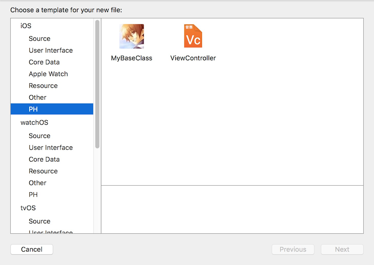
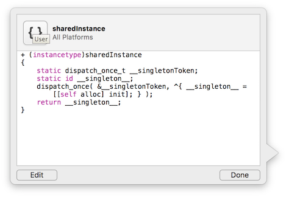

# iOS 统一编码风格

我们团队中有二十个人, 大神们都有自己的编程习惯, 而新手们呢还没有自己的风格, 还有些如我本人不同时期的风格不一样, 这导致了我们的代码有n种风格. 有的团队觉得每个人自己的风格统一了就好, 不能要求人人都死扣一些小细节; 有的团队则采用了严格的代码标准, 强制所有人的代码都是一个模子出来的, 如google.

如果团队内部可以统一风格, 采用同一个代码规范，让不同人写出来的程序可读性基本一致或者接近，这样对于新人来说, 做过1个模块后，在接触别人代码，别的模块代码的时候，无论开发还是维护都会更快上手, 他的精力可以更多放在其他方面。同时, 好的代码规范，编程习惯也可以减少bug的产生，减少开发人员和测试人员的的时间成本。

统一编码风格这个问题能难得到程序员么? 显然不能.

## 代码格式化 (Code Format)

有的小伙伴喜欢K&R风格, 有的喜欢BSD风格. 有的小伙伴代码锁在一起, 等号左右不空格, 逗号不空格.

可以采用`BBUncrustifyPlugin-Xcode`插件, 在save的时候会自动格式化. 如

```
// 喜欢K&R风格的小伙伴
// 将左括号留在前一行的末尾
if(1){
	a=b;
}

// 在他保存代码的时候就自动变成BSD风格啦
// 左右括号都单独占一行
if (1)
{
	a = b;
}
```

在格式化的时候还做了额外的设置. if和括号之间也加了空格, 等号左右也加了空格.

## 代码模板 (Code Template)

不同的小伙伴, 类的代码组织结构也不一样, 如我本人的`ViewController`类喜欢按照以下顺序来组织代码结构

```
#pragma mark - def
#pragma mark - override
#pragma mark - api
#pragma mark - model event 
#pragma mark - view event
#pragma mark - private
#pragma mark - getter / setter
```

统一代码结构可以对常用的类做代码模板, 如`Handle`, `Model`, `ViewController`, `TableViewControoler`, `View`类.

模板的制作教程可以参考<http://blog.csdn.net/uxyheaven/article/details/48419963>.

多才多艺的同事还给模板都设计了统一的LOGO.



## 代码片段(Code Snippets)
一些常用的代码片段, 也添加了快捷方式. 



如单利方法, 输入`qsi`就自动出来啦.

```
+ (instancetype)sharedInstance
{
    static dispatch_once_t __singletonToken;
    static id __singleton__;
    dispatch_once( &amp;__singletonToken, ^{ __singleton__ = [[self alloc] init]; } );
    return __singleton__;
}
```

## 代码扫描 (Code Scan)
一个方法内的行数过长, 复杂度过高的话, 可以通过对项目进行静态扫描来发现.

静态扫描的帖子可以参考 <http://blog.csdn.net/uxyheaven/article/details/50818107>.

它还可以发现如下问题:

* 可能的bug - 空的 if / else / try / catch / finally 语句
* 未使用的代码 - 未使用的局部变量和参数
* 复杂的代码 - 高圈复杂度, NPath复杂, 高NCSS
* 冗余代码 - 多余的if语句和无用的括号
* 坏味道的代码 - 过长的方法和过长的参数列表
* 不好的使用 - 倒逻辑和入参重新赋值

# Script
为了方便安装, 可以将`Code Format`, `Code Snippets`, `Code Scan`, 写一个简单的脚本.

```
#!/bin/bash+x

CURRENT_DIR=$(cd "$(dirname "$0")"; pwd)
PLUGIN_DIR="${HOME}/Library/Application Support/Developer/Shared/Xcode/Plug-ins/"
PLUGIN_CONFIG_DIR="${HOME}/.uncrustify"
SNIPPET_DIR="${HOME}/Library/Developer/Xcode/UserData/"
TEMPLATE_DIR="/Applications/Xcode.app/Contents/Developer/Platforms/iPhoneOS.platform/Developer/Library/Xcode/"

# 安装代码格式化插件
mkdir -p "${PLUGIN_DIR}"
sudo cp -rf "${CURRENT_DIR}/Plug-ins/UncrustifyPlugin.xcplugin" "${PLUGIN_DIR}"

# 格式化插件配置文件移动
mkdir -p "${PLUGIN_CONFIG_DIR}"
sudo cp -rf "${CURRENT_DIR}/uncrustify.cfg" "${PLUGIN_CONFIG_DIR}"

# # 安装代码模板
mkdir -p "${TEMPLATE_DIR}"
sudo cp -rf "${CURRENT_DIR}/Templates" "${TEMPLATE_DIR}"

# 安装代码块
mkdir -p "${SNIPPET_DIR}"
sudo cp -rf "${CURRENT_DIR}/CodeSnippets" "$SNIPPET_DIR"

# Clean
cd "${PLUGIN_DIR}"
rm -rf __MACOSX

echo "\nPAPH Code Style successfuly installed! Please restart your Xcode."
```

演示的demo里有配置好的格式化风格的插件, 但是只放了一个代码模板和一个单例的代码片段, 可以在这里下载到<https://github.com/uxyheaven/XYStyle>.

以上便是我们团队关于代码风格统一所作出的努力和尝试.


